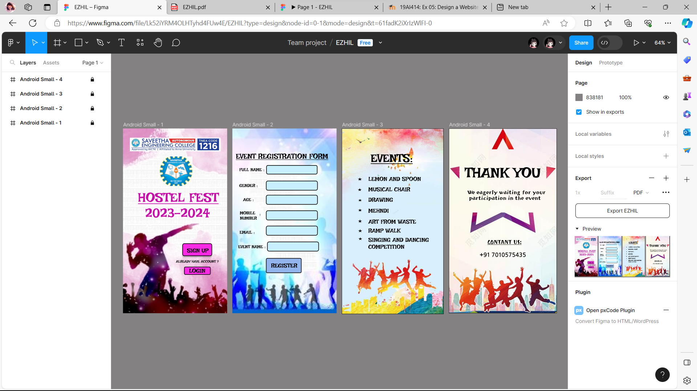

# Ex09 Event Registration Web Application
## Date:28.12.2023

## AIM:
To design, develop and deploy a web application for event registration.

## DESIGN STEPS:

### Step 1:
Create a new frame.

### Step 2:
Select any one preset size of your choice.

### Step 3:
Select the shapes you need.

### Step 4:
Import images as needed.

### Step 5:
Create pages based on your need and link them.

### Step 6:

Validate the HTML and CSS code.

### Step 6:

Publish the website in the given URL.

## DESIGN TOOL:
Figma

## CODE:
```
Home page 

<div style="width: 100%; height: 100%; position: relative; background: white">
    
    
    <div style="left: 52px; top: 212px; position: absolute; color: #C60FA8; font-size: 45px; font-family: Irish Grover; font-weight: 400; text-decoration: underline; word-wrap: break-word">HOSTEL FEST</div>
    <div style="width: 99px; height: 40px; left: 207px; top: 400px; position: absolute; background: #F929E4; box-shadow: 0px 4px 4px rgba(0, 0, 0, 0.25); border-radius: 5px; border: 2px black solid"></div>
    <div style="width: 79px; height: 15px; left: 219px; top: 411px; position: absolute; text-align: center; color: black; font-size: 20px; font-family: Irish Grover; font-weight: 400; word-wrap: break-word">SIGN UP</div>
    
    <div style="left: 183px; top: 453px; position: absolute; text-align: center; color: black; font-size: 12px; font-family: Irish Grover; font-weight: 400; word-wrap: break-word">ALREADY HAVE ACCOUNT ?</div>
    <div style="width: 88px; height: 24px; left: 213px; top: 481px; position: absolute; background: #F929E4; border-radius: 3px; border: 2px black solid"></div>
    <div style="left: 228px; top: 481px; position: absolute; text-align: center; color: black; font-size: 20px; font-family: Irish Grover; font-weight: 400; word-wrap: break-word">LOGIN</div>
    <div style="left: 76px; top: 266px; position: absolute; color: #C60FA8; font-size: 45px; font-family: Irish Grover; font-weight: 400; word-wrap: break-word">2023-2024</div>
</div>

// HOSTEL FEST
color: #C60FA8;
 font-size: 45px;
 font-family: Irish Grover;
 font-weight: 400;
 text-decoration: underline;
 word-wrap: break-word
---
// SIGN UP
color: black;
 font-size: 20px;
 font-family: Irish Grover;
 font-weight: 400;
 word-wrap: break-word
---
// ALREADY HAVE ACCOUNT ?
color: black;
 font-size: 12px;
 font-family: Irish Grover;
 font-weight: 400;
 word-wrap: break-word
---
// LOGIN
color: black;
 font-size: 20px;
 font-family: Irish Grover;
 font-weight: 400;
 word-wrap: break-word
---
// 2023-2024
color: #C60FA8;
 font-size: 45px;
 font-family: Irish Grover;
 font-weight: 400;
 word-wrap: break-word


 EVENT REGISTRATION PAGE

 <div style="width: 100%; height: 100%; position: relative; background: white">
    
    <div style="width: 175px; height: 30px; left: 118px; top: 339px; position: absolute; background: #C8EFFC; border-radius: 5px; border: 2px black solid"></div>
    <div style="width: 175px; height: 30px; left: 118px; top: 183px; position: absolute; background: #C8EFFC; border-radius: 5px; border: 2px black solid"></div>
    <div style="left: 24px; top: 189px; position: absolute; color: black; font-size: 15px; font-family: Irish Grover; font-weight: 400; word-wrap: break-word">GENDER :</div>
    <div style="left: 12px; top: 81px; position: absolute; color: black; font-size: 25px; font-family: Irish Grover; font-weight: 400; text-decoration: underline; text-transform: uppercase; word-wrap: break-word">event registration form</div>
    <div style="width: 175px; height: 30px; left: 118px; top: 128px; position: absolute; background: #C8EFFC; border-radius: 5px; border: 2px black solid"></div>
    <div style="left: 24px; top: 134px; position: absolute; color: black; font-size: 15px; font-family: Irish Grover; font-weight: 400; word-wrap: break-word">FULL NAME :</div>
    <div style="width: 175px; height: 30px; left: 118px; top: 232px; position: absolute; background: #C8EFFC; border-radius: 5px; border: 2px black solid"></div>
    <div style="left: 37px; top: 238px; position: absolute; color: black; font-size: 15px; font-family: Irish Grover; font-weight: 400; word-wrap: break-word">AGE :</div>
    <div style="width: 175px; height: 30px; left: 118px; top: 286px; position: absolute; background: #C8EFFC; border-radius: 5px; border: 2px black solid"></div>
    <div style="left: 26px; top: 284px; position: absolute; color: black; font-size: 15px; font-family: Irish Grover; font-weight: 400; word-wrap: break-word">MOBILE <br/>NUMBER</div>
    <div style="left: 25px; top: 351px; position: absolute; color: black; font-size: 15px; font-family: Irish Grover; font-weight: 400; word-wrap: break-word">EMAIL :</div>
    <div style="width: 175px; height: 30px; left: 122px; top: 394px; position: absolute; background: #C8EFFC; border-radius: 5px; border: 2px black solid"></div>
    <div style="left: 20px; top: 401px; position: absolute; color: black; font-size: 15px; font-family: Irish Grover; font-weight: 400; word-wrap: break-word">EVENT NAME :</div>
    <div style="width: 119px; height: 48px; left: 118px; top: 451px; position: absolute; background: #91B5EC; border-radius: 3px; border: 2px black solid"></div>
    <div style="left: 134px; top: 463px; position: absolute; color: black; font-size: 20px; font-family: Irish Grover; font-weight: 400; word-wrap: break-word">REGISTER</div>
    <div style="left: 94px; top: 288px; position: absolute; color: black; font-size: 15px; font-family: Irish Grover; font-weight: 400; word-wrap: break-word">:</div>
</div>

// GENDER :
color: black;
 font-size: 15px;
 font-family: Irish Grover;
 font-weight: 400;
 word-wrap: break-word
---
// event registration form
color: black;
 font-size: 25px;
 font-family: Irish Grover;
 font-weight: 400;
 text-decoration: underline;
 text-transform: uppercase;
 word-wrap: break-word
---
// FULL NAME :
color: black;
 font-size: 15px;
 font-family: Irish Grover;
 font-weight: 400;
 word-wrap: break-word
---
// AGE :
color: black;
 font-size: 15px;
 font-family: Irish Grover;
 font-weight: 400;
 word-wrap: break-word
---
// MOBILE <br/>NUMBER
color: black;
 font-size: 15px;
 font-family: Irish Grover;
 font-weight: 400;
 word-wrap: break-word
---
// EMAIL :
color: black;
 font-size: 15px;
 font-family: Irish Grover;
 font-weight: 400;
 word-wrap: break-word
---
// EVENT NAME :
color: black;
 font-size: 15px;
 font-family: Irish Grover;
 font-weight: 400;
 word-wrap: break-word
---
// REGISTER
color: black;
 font-size: 20px;
 font-family: Irish Grover;
 font-weight: 400;
 word-wrap: break-word
---
// :
color: black;
 font-size: 15px;
 font-family: Irish Grover;
 font-weight: 400;
 word-wrap: break-word

 EVENT DETAILS PAGE

 <div style="width: 100%; height: 100%; position: relative; background: white">
    
    <div style="left: 92px; top: 342px; position: absolute; color: black; font-size: 20px; font-family: Irish Grover; font-weight: 400; text-transform: uppercase; word-wrap: break-word">RAMP WALK</div>
    <div style="left: 92px; top: 199px; position: absolute; color: black; font-size: 20px; font-family: Irish Grover; font-weight: 400; word-wrap: break-word">MUSICAL CHAIR</div>
    <div style="left: 100px; top: 79px; position: absolute; color: black; font-size: 40px; font-family: Irish Grover; font-weight: 400; text-decoration: underline; word-wrap: break-word">EVENTS:</div>
    <div style="left: 92px; top: 163px; position: absolute; color: black; font-size: 20px; font-family: Irish Grover; font-weight: 400; word-wrap: break-word">LEMON AND SPOON</div>
    <div style="left: 92px; top: 235px; position: absolute; color: black; font-size: 20px; font-family: Irish Grover; font-weight: 400; word-wrap: break-word">DRAWING</div>
    <div style="left: 92px; top: 273px; position: absolute; color: black; font-size: 20px; font-family: Irish Grover; font-weight: 400; text-transform: uppercase; word-wrap: break-word">mehndi</div>
    <div style="left: 92px; top: 311px; position: absolute; color: black; font-size: 20px; font-family: Irish Grover; font-weight: 400; text-transform: uppercase; word-wrap: break-word">ART FROM waste</div>
    <div style="left: 92px; top: 374px; position: absolute; color: black; font-size: 20px; font-family: Irish Grover; font-weight: 400; text-transform: uppercase; word-wrap: break-word">singing and dancing <br/>competition</div>
</div>

// RAMP WALK
color: black;
 font-size: 20px;
 font-family: Irish Grover;
 font-weight: 400;
 text-transform: uppercase;
 word-wrap: break-word
---
// MUSICAL CHAIR
color: black;
 font-size: 20px;
 font-family: Irish Grover;
 font-weight: 400;
 word-wrap: break-word
---
// EVENTS:
color: black;
 font-size: 40px;
 font-family: Irish Grover;
 font-weight: 400;
 text-decoration: underline;
 word-wrap: break-word
---
// LEMON AND SPOON
color: black;
 font-size: 20px;
 font-family: Irish Grover;
 font-weight: 400;
 word-wrap: break-word
---
// DRAWING
color: black;
 font-size: 20px;
 font-family: Irish Grover;
 font-weight: 400;
 word-wrap: break-word
---
// mehndi
color: black;
 font-size: 20px;
 font-family: Irish Grover;
 font-weight: 400;
 text-transform: uppercase;
 word-wrap: break-word
---
// ART FROM waste
color: black;
 font-size: 20px;
 font-family: Irish Grover;
 font-weight: 400;
 text-transform: uppercase;
 word-wrap: break-word
---
// singing and dancing <br/>competition
color: black;
 font-size: 20px;
 font-family: Irish Grover;
 font-weight: 400;
 text-transform: uppercase;
 word-wrap: break-word

 LAST PAGE

 <div style="width: 100%; height: 100%; position: relative; background: white; box-shadow: 5px 10px 4px #F6C292; border: 1px black solid">
    
    <div style="left: 64px; top: 212px; position: absolute; color: black; font-size: 20px; font-family: JejuHallasan; font-weight: 400; word-wrap: break-word">We eagerly waiting for your<br/> participation in the event</div>
    <div style="left: 106px; top: 380px; position: absolute; text-align: center"><span style="color: black; font-size: 20px; font-family: JejuGothic; font-weight: 400; word-wrap: break-word">  </span><span style="color: black; font-size: 20px; font-family: Joti One; font-weight: 400; text-decoration: underline; word-wrap: break-word">CONTANT US:<br/></span><span style="color: black; font-size: 20px; font-family: JejuGothic; font-weight: 400; word-wrap: break-word"><br/>+91 7010575435 </span></div>
    <div style="left: 55px; top: 123px; position: absolute; color: black; font-size: 50px; font-family: Irish Grover; font-weight: 400; word-wrap: break-word">THANK YOU</div>
</div>

// We eagerly waiting for your<br/> participation in the event
color: black;
 font-size: 20px;
 font-family: JejuHallasan;
 font-weight: 400;
 word-wrap: break-word
---
//   
color: black;
 font-size: 20px;
 font-family: JejuGothic;
 font-weight: 400;
 word-wrap: break-word
---
// CONTANT US:<br/>
color: black;
 font-size: 20px;
 font-family: Joti One;
 font-weight: 400;
 text-decoration: underline;
 word-wrap: break-word
---
// <br/>+91 7010575435 
color: black;
 font-size: 20px;
 font-family: JejuGothic;
 font-weight: 400;
 word-wrap: break-word
---
// THANK YOU
color: black;
 font-size: 50px;
 font-family: Irish Grover;
 font-weight: 400;
 word-wrap: break-word

```

## OUTPUT:


## RESULT:
The program to design, develop and deploy a web application for event registration is completed successfully.
